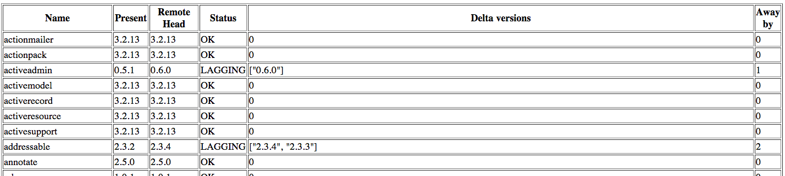

##Gem-Differencer

Small utility that points out how old your set of gems are.

The difference in the version numbers between your gem and the latest copy of the gem.

##Use-case

1. Determine how old your gems are. :-)
2. Get a picture of the effort needed to upgrade (one gem or entire gems or rails application)
3. Minor version deltas are also captured.

##Usage

`git clone` this repo. 

`cd gem-differencer`

Run `ruby difference-generator.rb` from within the root folder. 2 files are produced in the same directory.

##Output

1. Text file, `truth.txt`, contains the ruby-like dump of all the gems:
  * Current version.
  * Latest version available.
  * Array of difference in version numbers between your version and the latest version.
2. HTML file, `truth.html`, contains tabular format for all the gems:
  * Gem Name
  * Current version
  * Latest available version
  * Status (LAGGING / OK)
  * Array of the difference between your version and the latest version.
  * Number of versions your gem is from the latest one.

A snapshot of the HTML:

###GOTCHAS

Before running the program, make sure your environment has access to the gems you are targeting. Probable scenarios being:

1. User specific gems
2. rvm-backed gemsets.

This utility will only be able to access the gems that your current user-privilege and other settings can from `gem list` output.

###TODOS

1. Add gem dependency listing.
2. Add gem deltas for all dependencies.
3. Beautify the output (though that is un-necessary, IMO)
4. Open to suggestions in [Issues](https://github.com/i-arindam/gem-differencer/issues)
